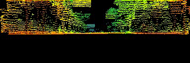

# 📝 Stand-alone Livox Lidar's Data Manipulation #
***

This library provides a simple interface to manipulate livox lidar's data sources without middleware dependencies (ROS, etc...). This is my modified version of [livox ros driver](https://github.com/Livox-SDK/livox_ros_driver)

## 🎛  Dependencies ##
***

- Ubuntu (tested on Ubuntu 18.04, 19.04)
- c++17 (mainly to use more modern cpp functions like std::any, filesystem)
- [livox sdk](https://github.com/Livox-SDK/Livox-SDK) that can be installed with
```bash
    sudo ./scripts/install_livox_sdk.sh
```

- c++ dependencies
```bash
sudo apt-get install \
    doxygen \
    libpcl-dev \
    librapidxml-dev \
```

- open3d (optional) : to visualize extracted pointcloud with python scripts. Install Open3d python package with:
```bash
    python3 -m pip install -r requirements.txt
```

## 🔨 How to Build ##
***

```bash
# build library
make all

# build examples
make apps -j`nproc`
```

## :running: How to Run ##
***

There are two applications included in this library. First to extract a lvx file into a list of pcd files. Second to visualize a lvx file.
*Currently these applications work best with the lvx files recorded with one lidar source.*

- Extract lvx file into a list of pcd files
```bash
# after make apps
./build/examples/lvx_to_pcd/lvx_to_pcd_app [path/to/lvx/file] [output/path/to/store/pcd/files] [publish/frequency/Hz]

#for example
./build/examples/lvx_to_pcd/lvx_to_pcd_app ./data/sample.lvx ./pcd_data 10.0
# The pcd files will be stored in pcd_data directory
```

Samples of lvx files can be downloaded from [livox tech website](https://www.livoxtech.com/downloads).

The extracted pcds can be viewed with either [visualize_pcd.py](./scripts/visualize_pcd.py) that uses [open3d](http://www.open3d.org/); or with [CloudCompare](https://github.com/CloudCompare/CloudCompare)

- Visualize a lvx file: this actually is a small open-source version of [Livox Viewer](https://www.livoxtech.com/downloads)

```bash
# after make apps
./build/examples/visualize_lvx/visualize_lvx [path/to/lvx/file] [publish/frequency/Hz]

#for example
./build/examples/visualize_lvx/visualize_lvx ./data/sample.lvx ./pcd_data 10.0
```

Here is visualization sample:


A dataset (with pcds from a street scene) can be downloaded with
```bash
python3 scripts/download_livox_horizon_dataset.py
```

### :camera: Spherical Projection ###
As a bonus, I have implemented the method to project pointcloud into a 2d depth image, that can be used as input for deep learning method on point cloud, or for fast depth clustering.

```bash
# after make apps
./build/examples/spherical_projection/spherical_projection [path/to/pcl/file/list] [path/to/pcd/data]

# after downloading the dataset I introduced above
./build/examples/spherical_projection/spherical_projection ./data/livox_horizon_data/pcd_files.txt ./data/livox_horizon_data/pcds

```



As the horizontal FOV of livox lidar is quite small compared to Velodyne lidar, the projected image size here is quite small.

## :gem: References ##
- [livox ros sdk](https://github.com/Livox-SDK/livox_ros_driver)
- [Low-cost Retina-like Robotic Lidars Based on Incommensurable Scanning](https://arxiv.org/pdf/2006.11034.pdf)
This paper is related to the scanning pattern of livox lidars
